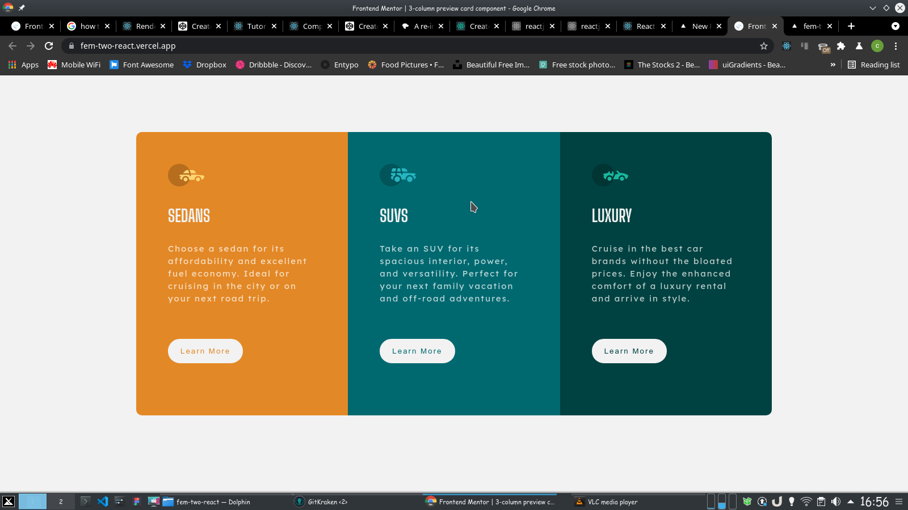

# Frontend Mentor - 3-column preview card component solution

This is a solution to the [3-column preview card component challenge on Frontend Mentor](https://www.frontendmentor.io/challenges/3column-preview-card-component-pH92eAR2-). Frontend Mentor challenges help you improve your coding skills by building realistic projects. 

## Table of contents

- [Frontend Mentor - 3-column preview card component solution](#frontend-mentor---3-column-preview-card-component-solution)
  - [Table of contents](#table-of-contents)
  - [Overview](#overview)
    - [The challenge](#the-challenge)
    - [Screenshot](#screenshot)
    - [Links](#links)
  - [My process](#my-process)
    - [Built with](#built-with)
    - [What I learned](#what-i-learned)
    - [Continued development](#continued-development)
    - [Useful resources](#useful-resources)
  - [Author](#author)
  - [Acknowledgments](#acknowledgments)

## Overview

### The challenge

Users should be able to:

- View the optimal layout depending on their device's screen size
- See hover states for interactive elements

### Screenshot

### Links

- Solution URL: (https://github.com/cyberraff/fem-two-react.git)
- Live Site URL: (https://fem-two-react.vercel.app/)

## My process

### Built with

- Semantic HTML5 markup
- CSS custom properties
- Flexbox
- CSS Grid
- Mobile-first workflow
- [React](https://reactjs.org/) - JS library
### What I learned

I officially utilized most of what i have een learning on  [React JS](https://reactjs.org/) on building this project.
i used React render method on this project and got to really see how it works first hand

### Continued development
i hpe t continually improve myself in the field of web development of someday cal myself a fullstack developer. 
### Useful resources

- [React JS](https://reactjs.org/) - This helped me in really getting to know React JS.
## Author

- Website - [@CyberRaff](https://twitter.com/CyberRaff)
- Frontend Mentor - [@cyberraff](https://www.frontendmentor.io/profile/cyberraff)
- Twitter - [@CyberRaff](https://twitter.com/CyberRaff)

## Acknowledgments
i am and will always be grateful to God for showing me  [@Front End Mentor](https://www.frontendmentor.io)
it has been a good step in helping me through the process of becoming a web developer.